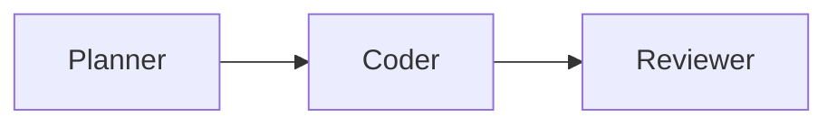

# Codex Agent Platform

A **turn-key starter kit** that combines Google’s **Agent Developer Kit (ADK)** with local **Model-Context-Protocol (MCP)** servers so an OpenAI-backed agent can clone, build, and iteratively develop *any* project you point it at—opening pull-requests, writing debriefs, and passing CI on its own.

---

## Quick-start

```bash
# 1. Clone the template into your new project folder
git clone https://github.com/ianlucas1/codex_agent_platform.git my-app
cd my-app

# 2. One-shot environment setup
./scripts/bootstrap.sh   # installs Python, Node, ADK (v0.5.0), MCP servers
# 3. List pending tasks
python scripts/parse_roadmap.py
```



| Env var                        | Purpose                                                      | Required |
| ------------------------------ | ------------------------------------------------------------ | -------- |
| `OPENAI_API_KEY`               | LLM calls via ADK / LiteLLM                                  | **Yes**  |
| `GITHUB_PERSONAL_ACCESS_TOKEN` | Agent’s Git push + PRs                                       | **Yes**  |
| `NO_NET=1`                     | Skip pip/npm downloads (Codex sandbox or fully offline mode) | Optional |

> **Tip:** Outside the Codex cloud sandbox you can omit `NO_NET=1` and let the agent fetch packages live.

---

## Repository layout

| Path                      | What lives here                                           |
| ------------------------- | --------------------------------------------------------- |
| `agents/`                 | AI agent code (starting with `dev_agent.py`)              |
| `configs/ROADMAP_TODO.md` | Machine-readable task queue (FS01 … FS27)                 |
| `scripts/`                | `bootstrap.sh` and helper scripts            |
| `mcp_servers/`            | launchers for Filesystem & GitHub MCP servers             |
| `reports/`                | `NNN_debrief.md` files the agent writes after each task   |
| `docs/`                   | Lessons learned, reference dossiers, `offline_setup.md`   |
| `AGENTS.md`               | Contributor guide + PR template & Codex-Cloud constraints |

---

## Roadmap status (20 May 2025)

* **Completed:** FS01–FS14.5 (bootstrap, agent stub, CI setup)
* **Next up:** FS16 status updater
* Live queue: see [`configs/ROADMAP_TODO.md`](configs/ROADMAP_TODO.md)

---

## Offline & sandbox quirks

Codex’s web IDE disables outbound network after the setup script.
The repo ships with:

* `scripts/bootstrap.sh` — installs all deps *before* the cutoff and respects `NO_NET=1`.
* `docs/offline_setup.md` — how to pre-vendor wheels/tarballs if you need total air-gap.

Outside Codex you can run the agent with full internet; these guard-rails simply ensure the same repo also works in the stricter sandbox.

---

*Happy hacking—let the agent open its first PR for you!* 🚀
