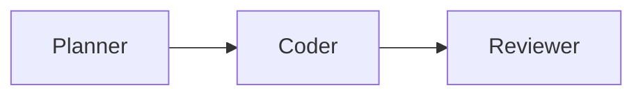

# Agent Platform

A **turn‑key starter kit** that pairs Google’s **Agent Development Kit** with a
Planner → Coder → Reviewer workflow, pre‑wired CI, and a minimal SOP. Spin up
an LLM‑powered assistant capable of opening pull‑requests, writing debriefs,
and passing CI on its own.

---

## Quick‑start

```bash
# 1. Clone the template into your new project folder
git clone https://github.com/ianlucas1/agent_platform.git my-app
cd my-app

# 2. One‑shot environment setup
./scripts/bootstrap.sh   # installs Python, Node, ADK, MCP servers

# 3. List pending roadmap tasks
python scripts/parse_roadmap.py
```



| Env var            | Purpose                                             | Required |
|--------------------|-----------------------------------------------------|----------|
| `OPENAI_API_KEY`   | LLM calls via ADK / LiteLLM                         | ✅       |
| `GITHUB_TOKEN`     | PR creation & comment bots (optional outside Codex) | optional |

---

## Roadmap

High\-level roadmap & vision: **docs/vision_roadmap.md**
Detailed task list: **docs/todo_tasks.md**

To view current progress programmatically:

```bash
python scripts/parse_roadmap.py                # table view
python scripts/parse_roadmap.py --format json  # JSON view
```

---

## Contributing

* Follow the workflow & coding standards in **LLM_COLLABORATOR.md** and **AGENTS.md**.  
* Branch names must start with `codex/…` so the Codex UI shows **Push ▾ / Create PR**.  
* Pass Ruff · Black · Bandit linters (and `pytest -q` once tests exist) before committing.  
* Update docs and tick the roadmap when you complete a task.

See **docs/prompt_templates/** for ready‑made assumption‑check and tasking prompts.

---

## Offline & sandbox quirks

Codex’s sandbox disables outbound network after the setup script finishes.
`scripts/bootstrap.sh` installs all dependencies **before** the cutoff and
exports `NO_NET=1` so subsequent commands run offline.  
Outside Codex you get full internet; the repo simply ensures the same code also
works in the stricter sandbox.

---

*Happy hacking—let the agent open its first PR for you!* 🚀
